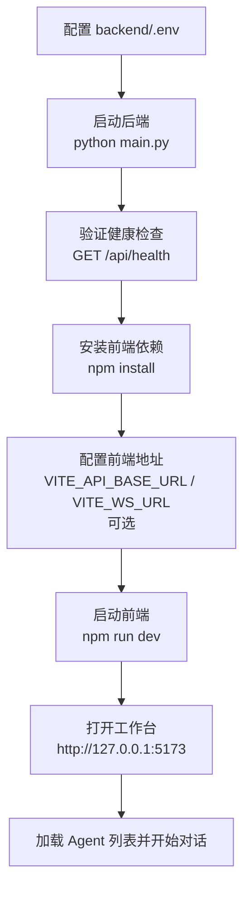
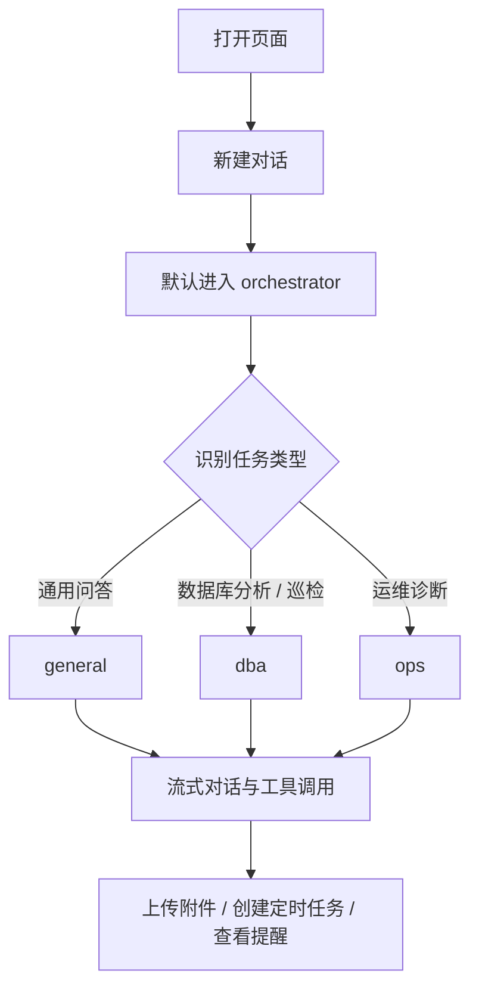
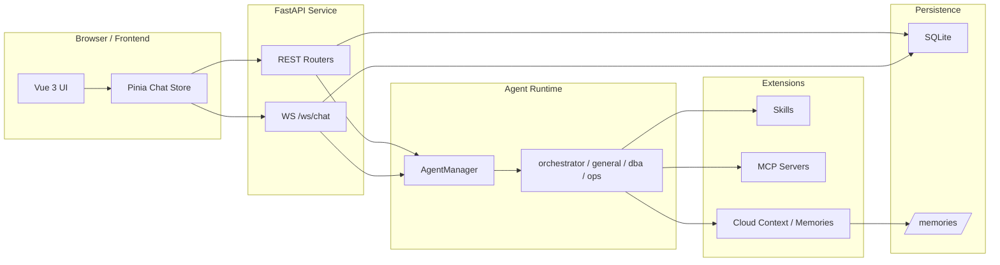
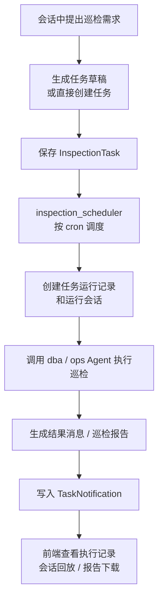

# AgentWeave

AgentWeave 是一个基于 **FastAPI + Vue 3 + DeepAgents/LangGraph** 的多 Agent 智能编排与运维平台示例。它提供 Web 对话入口，并围绕 Agent 路由、Skills 白名单装配、定时巡检任务、任务提醒、会话附件、MCP Server、云凭证解析和长期记忆构建了一套可运行的工作台。

当前仓库更适合被理解为“开发中的平台骨架 + 已落地的核心流程”，而不是单一聊天 Demo。

## 核心能力

- **默认入口是 `orchestrator`**：新会话默认进入智能编排助手，由它识别意图并把专业任务路由给 `dba` 或 `ops`。
- **4 个内置 Agent**：`orchestrator`、`general`、`dba`、`ops`，每个 Agent 都有自己的提示词、风险等级和可用 Skills 集合。
- **Skills 白名单装配**：Skills 统一放在 [backend/skills](backend/skills)，Agent 运行时按白名单注入，而不是靠前端隐藏。
- **WebSocket 流式对话**：主聊天链路走 `/ws/chat`，支持文本增量推流、思考过程、工具调用结果和子 Agent 路由事件。
- **定时巡检任务**：支持从会话生成定时任务、查看任务列表、执行记录和任务运行会话流式回放。
- **任务提醒中心**：任务执行成功或失败后生成通知，并可携带巡检报告下载信息。
- **会话附件**：支持在会话中上传文本类附件，当前支持 `.txt`、`.md`、`.csv`、`.json`、`.sql`、`.log`，单文件最大 1 MB。
- **MCP Server 管理**：支持在页面注册、测试并按 Agent 绑定 MCP Server。
- **云凭证与上下文解析**：支持根据消息内容解析云实例上下文，服务于 MySQL 巡检等场景。
- **SQLite + LangGraph 持久化**：对话、消息、任务、MCP 配置等业务数据落库，长期记忆通过 `/memories/` 暴露。

## 界面预览

### 浅色模式


### 深色模式


### Skills 面板


### 流式对话


## 快速开始

启动路径总览：



### 环境要求

- Python 3.10+
- Node.js 18+
- SQLite

### 1. 启动后端

```powershell
cd backend
python -m venv .venv
.\.venv\Scripts\Activate.ps1
pip install -r requirements.txt
```

在 `backend/.env` 中至少配置：

```dotenv
ANTHROPIC_API_KEY=your-api-key

# 可选
MODEL_NAME=claude-sonnet-4-5-20250929
SQLITE_PATH=data/app.db
LOG_LEVEL=INFO
```

然后启动后端：

```powershell
python main.py
```

默认监听 `http://127.0.0.1:8000`。健康检查接口：

```text
GET /api/health
```

如果 `ANTHROPIC_API_KEY` 未配置，健康检查仍会返回 `status=ok`，但 Agent 对话能力不可用。

### 2. 启动前端

```powershell
cd frontend
npm install
```

如果前端开发服务器和后端不在同一 Origin，启动前设置：

```text
VITE_API_BASE_URL=http://127.0.0.1:8000
VITE_WS_URL=ws://127.0.0.1:8000/ws/chat
```

然后启动开发服务器：

```powershell
npm run dev
```

默认地址是 `http://127.0.0.1:5173`。

如果不设置环境变量，前端会默认使用“同域 REST + 当前 Host 的 `/ws/chat`”。

### 3. 使用 Docker Compose（部署 / 演示模式）

仓库根目录的 [docker-compose.yml](docker-compose.yml) 用于一键启动前后端的部署 / 演示环境：

```powershell
docker compose up -d --build
```

默认暴露：

- 前端：`http://127.0.0.1`
- 后端：`http://127.0.0.1:8000`

健康检查与依赖关系：

- `backend` 会通过 `GET /api/health` 做容器内健康检查
- `frontend` 会等待 `backend` 进入 healthy 后再启动

持久化目录：

- `./backend/data -> /app/data`

说明：

- 这套 Compose 面向部署 / 演示，不承担本地开发热更新职责
- `skills`、`prompts` 等内容会随镜像一起构建；修改后需要重新执行 `docker compose up -d --build`
- 本地开发仍推荐使用上面的 `python main.py` + `npm run dev` 启动方式

### 4. 运行测试

前端测试：

```powershell
cd frontend
npm run test
```

后端测试：

```powershell
cd backend
pytest
```

## Agent 与使用方式

用户使用路径总览：



### 当前内置 Agent

| Agent | 用途 | 说明 | 默认可用 Skills |
| --- | --- | --- | --- |
| `orchestrator` | 默认入口 | 识别意图、路由任务、协调结果 | `using-superpowers` |
| `general` | 通用问答 | 文档阅读、代码解释、Markdown 整理 | `file_reader`、`code_explainer`、`obsidian-markdown`、`using-superpowers` |
| `dba` | 数据库分析 | MySQL SQL 分析、RDS 巡检、报告摘要 | `mysql-sql-analyzer`、`volcengine-rds-health-analyzer`、`volcengine-rds-report-summarizer`、`using-superpowers` |
| `ops` | 运维诊断 | 远程运维、Docker 排查、Kubernetes 诊断 | `remote-ops`、`docker`、`kubernetes`、`using-superpowers` |

### 推荐使用路径

- 新对话默认从 `orchestrator` 开始。
- 明确知道任务属于数据库或运维领域时，可以直接切到 `dba` 或 `ops`。
- `general` 更适合通用问答、文档处理和代码解释。
- 会话一旦创建，会固定绑定 `agent_id`；新开会话才会重新回到默认入口 `orchestrator`。

### 当前前端工作台包含的面板

- 会话列表与标题编辑
- 主聊天区与流式消息渲染
- Skills 面板
- MCP 面板
- 记忆面板
- 会话附件条
- 定时任务抽屉
- 任务提醒中心

## 关键子系统

系统架构与请求流：



### 1. Agent 编排

- Agent 定义位于 [backend/agent_profiles.py](backend/agent_profiles.py)。
- 运行时由 [backend/agent_manager.py](backend/agent_manager.py) 负责初始化、缓存和按需加载。
- 默认 Agent 是 `orchestrator`，配置来源于 `DEFAULT_AGENT_ID = "orchestrator"`。

### 2. 会话与消息流

- FastAPI 在 [backend/main.py](backend/main.py) 注册 REST 和 WebSocket 路由。
- 主对话通道在 [backend/api/ws/chat.py](backend/api/ws/chat.py)。
- 会话、消息、标题和 Agent 绑定逻辑主要在 `services/conversation_*` 中实现。

### 3. 定时任务与提醒

定时巡检任务链路：



- 定时任务 API 位于 [backend/api/routers/inspection_tasks.py](backend/api/routers/inspection_tasks.py)。
- 任务调度与执行逻辑位于 `services/inspection_scheduler.py` 和 `services/inspection_tasks.py`。
- 提醒中心由 `task_notifications` 路由和服务层提供。

### 4. 扩展能力

- Skills 元数据通过 [backend/skill_catalog.py](backend/skill_catalog.py) 扫描。
- MCP Server 注册与测试由 `services/mcp_registry.py` 提供。
- 云凭证解析接口位于 `api/routers/cloud_credentials.py`。
- 会话附件上传与持久化位于 `conversation_attachments` 路由与服务。

### 5. 持久化与记忆

- SQLite 连接配置在 [backend/config.py](backend/config.py) 和 `db/session.py`。
- 业务表包括 `Conversation`、`Message`、`InspectionTask`、`InspectionTaskRun`、`TaskNotification`、`McpServer`、`ConversationAttachment`。
- 长期记忆通过 `/api/memories` 暴露，底层使用 LangGraph Store。

## 主要接口

| 接口 | 作用 |
| --- | --- |
| `GET /api/health` | 健康检查和 API Key 配置状态 |
| `GET /api/agents` | 获取 Agent 列表和默认 Agent |
| `GET/POST/PATCH/DELETE /api/conversations` | 会话列表、创建、重命名、删除 |
| `POST /api/conversations/attachments` | 上传会话附件 |
| `GET /api/skills?agent_id=...` | 获取某个 Agent 可见的 Skills |
| `GET/POST/... /api/inspection-tasks` | 定时任务、草稿生成、执行记录与流式回放 |
| `GET/POST /api/task-notifications` | 任务提醒列表和已读状态 |
| `GET/POST/PUT/DELETE /api/mcp/servers` | MCP Server 管理与测试 |
| `GET/PUT/POST /api/cloud-credentials/...` | 云凭证注册表与上下文解析 |
| `GET/DELETE /api/memories/...` | 记忆树、记忆内容读取与删除 |
| `WS /ws/chat` | 主对话通道 |

## 项目结构

```text
ops-skills-agent-demo/
├── backend/
│   ├── main.py                  # FastAPI 入口
│   ├── agent.py                 # AgentWeave 运行入口
│   ├── agent_profiles.py        # Agent 配置与默认 Agent
│   ├── agent_manager.py         # Runtime 初始化与缓存
│   ├── api/
│   │   ├── routers/             # REST 路由
│   │   └── ws/chat.py           # WebSocket 对话入口
│   ├── services/                # 会话、任务、提醒、MCP、记忆等服务
│   ├── models/                  # ORM 模型
│   ├── skills/                  # Markdown Skills 仓库
│   ├── prompts/                 # base/general/dba/ops/orchestrator 提示词
│   ├── db/                      # SQLAlchemy 会话与基类
│   └── tests/                   # 后端测试
├── frontend/
│   ├── src/App.vue              # 主工作台布局
│   ├── src/components/          # 会话、任务、提醒、MCP、记忆等组件
│   ├── src/stores/chat/         # Pinia 聊天域状态
│   └── src/utils/               # 标题、任务意图、MySQL 巡检等工具
├── docs/                        # 设计文档和界面截图
└── docker-compose.yml           # 前后端容器编排
```

## 进一步阅读

- [docs/skills-overview.md](docs/skills-overview.md)
- [docs/builtin-skills-design.md](docs/builtin-skills-design.md)
- [docs/docker-design.md](docs/docker-design.md)
- [docs/kubernetes-design.md](docs/kubernetes-design.md)
- [docs/mysql-sql-analyzer-design.md](docs/mysql-sql-analyzer-design.md)
- [docs/remote-ops-design.md](docs/remote-ops-design.md)
