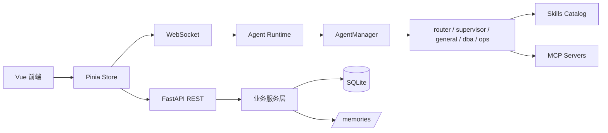

# 项目整体设计

## 1. 目标

AgentWeave 提供一个围绕多 Agent 运行时、定时巡检和长期记忆的工作台。当前架构以 `router` 作为统一入口，以 `supervisor` 作为复杂任务协调层，`general`、`dba`、`ops` 作为叶子执行 Agent。

## 2. 总体结构

## 3. 关键原则

### 3.1 统一入口

系统默认通过 `router` 作为会话入口。`router` 负责轻量意图识别、单域分流与升级判断；遇到复杂、多域或异常场景时，交给 `supervisor` 统一协调。

### 3.2 能力白名单

Skills 和 MCP 能力都由后端按 Agent 配置注入，前端不直接定义运行时能力边界。

### 3.3 持久化与记忆

对话、消息、巡检任务、MCP 配置等数据落在 SQLite；长期记忆通过 `/memories/` 暴露给运行时读取与写入。

## 4. 运行时分层

- `router`：默认入口、单域直达、升级判断
- `supervisor`：复杂任务编排、跨域协调、结果整合
- `general`：通用问答、文档阅读、代码解释
- `dba`：数据库分析、RDS 巡检、数据库诊断
- `ops`：远程运维、Docker 排障、Kubernetes 诊断
