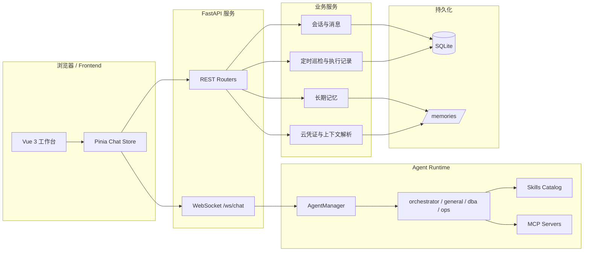

# AgentWeave 项目总设计文档

## 1. 项目定位

AgentWeave 是一个面向运维与数据库场景的 **多 Agent 智能工作台**。项目以 `FastAPI + Vue 3 + DeepAgents/LangGraph` 为核心技术栈，把对话入口、Agent 路由、Skills 装配、定时巡检任务、任务提醒、MCP Server、云凭证解析和长期记忆整合为同一套平台骨架。

与单纯的聊天 Demo 不同，本项目更偏向“可持续扩展的 Agent 平台”：

- 前端提供统一工作台，承载会话、附件、任务、提醒、MCP 和记忆面板。
- 后端负责 Agent 运行时装配、路由编排、业务 API、WebSocket 流式事件和定时任务调度。
- Skills 使用 Markdown 文件作为能力封装单元，通过白名单方式按 Agent 注入。
- 持久化层同时覆盖业务数据与长期记忆，支持会话延续和任务回放。

## 2. 总体架构



## 3. 设计目标

### 3.1 统一入口

系统默认通过 `orchestrator` 作为会话入口，在用户不需要关心内部实现的前提下，让平台自动识别请求属于通用问答、数据库分析还是运维诊断。

### 3.2 能力白名单化

Skills 不直接由前端拼接或硬编码，而是由后端按 Agent 配置进行白名单注入。这样可以同时满足：

- 不同 Agent 只暴露其应拥有的能力
- Skill 升级后无需改前端协议
- 运行时能力边界由后端集中控制

### 3.3 流式交互

对话主链路采用 `WebSocket`，支持：

- 文本增量输出
- 思考过程显示
- 工具调用与工具结果回显
- 子 Agent 路由事件
- 任务运行过程回放

### 3.4 业务化扩展

项目不仅支持即时问答，还把“巡检任务草稿 → 定时执行 → 结果归档 → 提醒通知 → 报告下载”打通，形成可长期使用的运维/巡检工作流。

## 4. 模块划分

| 模块 | 主要职责 | 关键目录 |
|------|----------|----------|
| 前端工作台 | 对话 UI、任务抽屉、提醒中心、记忆面板、MCP 面板 | `frontend/src` |
| FastAPI 接口层 | 暴露 REST API 与 WebSocket | `backend/api`、`backend/main.py` |
| Agent 运行时 | Agent Profile、Prompt 拼装、Skill 注入、MCP 工具装配 | `backend/agent.py`、`backend/agent_manager.py` |
| 业务服务层 | 会话、附件、任务、提醒、记忆、云上下文 | `backend/services` |
| 技能仓库 | 领域技能与工具型技能的 Markdown 封装 | `backend/skills` |
| 持久化层 | SQLite 业务表与 LangGraph Store | `backend/models`、`backend/db`、`/memories/` |

## 5. 核心链路

### 5.1 实时对话链路

```text
用户发送消息
  → 前端通过 /ws/chat 建立或复用会话
  → 后端根据 conversation.agent_id 选择运行时
  → AgentManager 装配 Prompt、Skills、MCP Tools
  → Agent 执行并持续产出 text_delta / tool_call / tool_result / done 等事件
  → 前端按事件类型更新消息流、工具状态和子 Agent 标记
```

### 5.2 定时巡检链路

```text
会话中提出巡检需求
  → 后端生成任务草稿或直接创建 InspectionTask
  → Scheduler 按 cron 检查到期任务
  → 创建 InspectionTaskRun 和对应运行会话
  → 调用 dba / ops Agent 执行任务
  → 输出巡检结果、报告或失败信息
  → 写入 TaskNotification，前端展示提醒并支持回放
```

### 5.3 Skill 装配链路

```text
系统启动或请求 Agent 信息
  → skill_catalog 扫描 backend/skills/*/SKILL.md
  → 解析 skill 元数据
  → agent_profiles 为每个 Agent 声明 skill 白名单
  → AgentManager 在构建 runtime 时注入对应 skill 路径
```

## 6. 数据设计

### 6.1 业务表

后端主要业务实体包括：

- `Conversation`
- `Message`
- `ConversationAttachment`
- `InspectionTask`
- `InspectionTaskRun`
- `TaskNotification`
- `McpServer`
- 认证相关的 `User` / `Role` / `Permission`

这些表集中保存在 SQLite 中，适合示例项目和单机开发环境快速启动。

### 6.2 长期记忆

长期记忆通过 `/memories/` 暴露为文件型层次结构，用于存放：

- 全局指令
- Agent 级长期记忆
- 巡检报告与汇总报告
- 云凭证注册表等上下文信息

这部分由服务层统一转换为前端可浏览的树状结构。

## 7. 安全与边界

- **能力边界**：Agent 只能使用当前 runtime 注入的 Skills 和 MCP 工具。
- **权限边界**：REST API 通过权限依赖控制会话、任务、MCP、记忆等能力。
- **认证边界**：支持 OIDC 登录与本地 RBAC，未启用认证时可退化为开放模式。
- **凭证边界**：云凭证使用 `credential_ref` + `.env` / 注册表方式解析，避免在聊天中裸传密钥。
- **写操作边界**：高风险运维能力通过 Skill 文本规则和运行时约束控制。

## 8. 部署与运行

### 8.1 运行依赖

- Python 3.10+
- Node.js 18+
- SQLite
- Anthropic API Key

### 8.2 启动顺序

```text
配置 backend/.env
  → 启动 FastAPI 后端
  → 初始化数据库、Agent Runtime、Scheduler
  → 启动前端 Vite 工作台
  → 浏览器进入统一对话入口
```

### 8.3 容器化

项目根目录提供 `docker-compose.yml`，用于统一编排前后端容器。前端另附 `nginx.conf`，后端附 `Dockerfile`，便于后续部署到测试环境。

## 9. 演进建议

- **短期**：继续补齐更多领域 Skill，并为任务流和记忆流补更多端到端测试。
- **中期**：把 SQLite 抽象为可替换的数据层，支持更强的并发和审计能力。
- **中期**：增强 Agent 运行态观测，如链路追踪、耗时统计、技能命中统计。
- **长期**：引入多租户、权限隔离和更完善的执行沙箱，使其可演化为真实内部平台。

## 10. 相关设计文档

- 后端模块设计：`backend-design.md`
- 前端模块设计：`frontend-design.md`
- Agent 运行时设计：`agent-runtime-design.md`
- 定时任务子系统设计：`task-scheduling-design.md`
- Skills 专项设计索引：`skills-overview.md`
