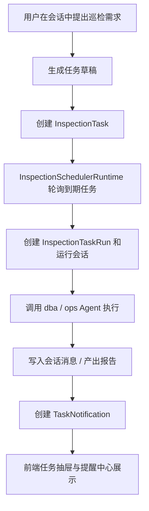

# 定时任务与提醒子系统设计说明

## 1. 子系统定位

定时任务子系统把即时对话能力延伸为可持续执行的巡检能力。它允许用户在会话中提出巡检需求后，将该需求沉淀为可定期运行的任务，并在执行后生成运行记录、通知和报告。

这是 AgentWeave 从“聊天工具”走向“自动化工作台”的关键一环。

## 2. 核心能力

- 从会话消息生成巡检任务草稿
- 创建、更新、删除和手动触发任务
- 按 cron 表达式调度任务
- 记录每次执行的运行信息
- 将执行结果推送为任务提醒
- 支持在前端回放任务运行会话

## 3. 架构



## 4. 关键模块

### 4.1 路由层

`api/routers/inspection_tasks.py` 暴露：

- 草稿生成
- 任务列表
- 任务创建
- 从会话消息直接生成任务
- 任务运行流式回放
- 手动触发任务
- 执行记录查询

`api/routers/task_notifications.py` 暴露：

- 通知列表
- 已读状态更新
- 批量已读

### 4.2 服务层

`services/inspection_tasks.py` 负责：

- 分析消息中的任务意图
- 生成任务草稿
- 规范化任务名称和 cron
- 创建任务与运行记录
- 执行任务并监听 Agent 事件
- 生成通知

`services/inspection_scheduler.py` 负责：

- 启动后台轮询循环
- 查找到期任务
- 触发任务执行
- 停止调度循环

## 5. 数据模型

该子系统依赖三个核心实体：

### 5.1 `InspectionTask`

表示任务本身，关注：

- 任务名称
- Agent 类型
- 调度表达式
- 任务输入内容
- 启用状态
- 最近执行时间 / 下次执行时间

### 5.2 `InspectionTaskRun`

表示某次具体执行，关注：

- 所属任务
- 执行状态
- 执行开始 / 结束时间
- 运行会话 ID
- 错误信息与摘要

### 5.3 `TaskNotification`

表示任务完成后的用户提醒，关注：

- 关联任务与运行记录
- 通知类型与状态
- 是否已读
- 产物路径或摘要信息

## 6. 任务创建流程

```text
用户在会话中提出需求
  → 后端识别该消息是否包含“定时执行”语义
  → 生成任务草稿
  → 用户确认任务名称、cron、Agent 等配置
  → 保存为 InspectionTask
```

这里的关键设计点是：任务不是完全脱离聊天创建，而是从会话上下文中提炼而来，减少重复输入。

## 7. 任务执行流程

```text
Scheduler 发现到期任务
  → 创建 InspectionTaskRun
  → 生成一条新的运行会话
  → 使用任务配置的 Agent 执行巡检
  → 按事件流写入会话消息
  → 完成后更新运行记录状态
  → 创建 TaskNotification
```

通过“运行会话”这一设计，任务执行结果可以和普通对话共享同一套消息展示与回放机制。

## 8. 前端交互设计

前端主要通过两个 UI 承载该子系统：

- `TaskDrawer`：管理任务、草稿和执行记录
- `TaskNotificationCenter`：展示完成/失败通知与未读数

这样可以把“配置任务”和“接收结果”分离，减少单个面板的复杂度。

## 9. 设计取舍

- 使用轮询式调度器实现简单、可读性强，但不适合高精度大规模调度
- 任务执行复用现有会话链路，降低重复实现成本，但要求消息模型更通用
- 通知单独建模，增强了异步体验，但也引入了额外状态同步复杂度

## 10. 后续演进方向

- 支持更多任务模板和任务类型，而不仅限于巡检
- 为任务增加更完善的重试、超时和熔断策略
- 增加任务级权限、审计日志和执行统计
- 把轮询调度升级为更专业的调度框架或分布式调度能力
